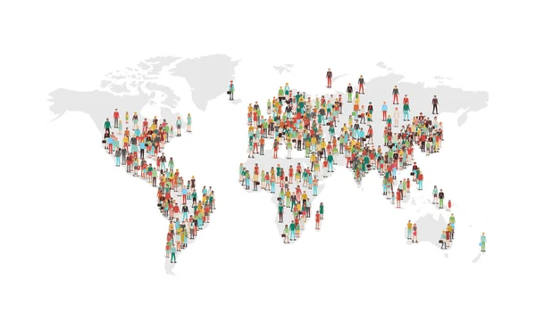
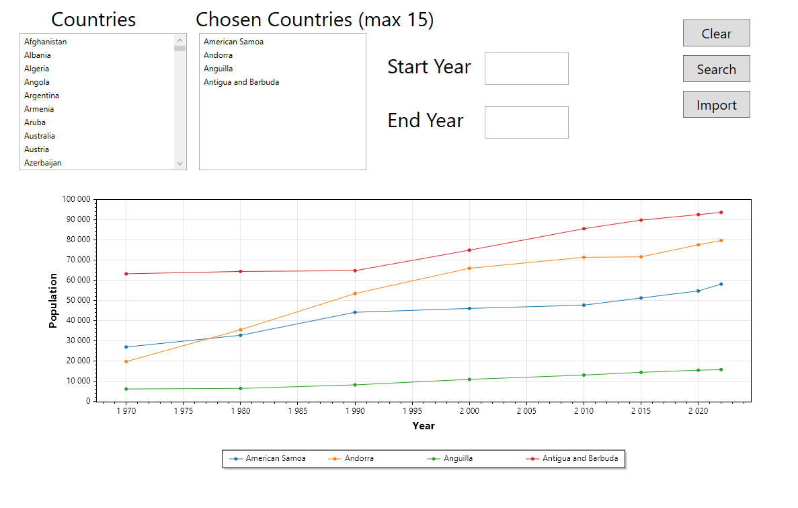

# P_FUN (Plot_That_Line)
## Context
This project was directed by [Xavier Carrel](https://github.com/XCarrel) with the module [module 323 ICT](https://www.modulbaukasten.ch/module/323/1/fr-FR?title=Programmer-de-mani%C3%A8re-fonctionnelle) made side by side, that helps up learn about the functional programming. For this project, I decided to make an app that reads a CSV about data of the world population per country and displays it in a graph.

## Methodology
We used an agile methodology with [IceScrum](https://www.icescrum.com/) ([Link to the IceScrum of my project](https://etml.icescrum.com/p/LUCSIMOESP/#/project)) to create our User Stories.

## Documentation
The project report and the work diary is in the [docs](docs/) folder 

## CSV
The CSV is composed of multiple columns:
<ul>
<li>Rank</li>
<li>CCA3</li>
<li>Name</li>
<li>Capital</li>
<li>Continent</li>
<li>Population Data (List of numbers)</li>
</ul>
Each element is separated with a ","

## Preview

## Sources
<ul>
<li>
<a href="https://www.kaggle.com/datasets/iamsouravbanerjee/world-population-dataset?resource=download">dataset</a>
</li>
</ul>